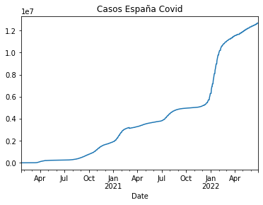
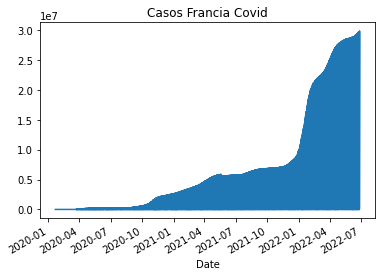
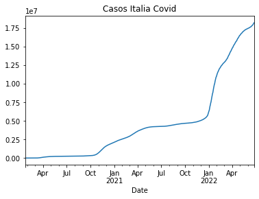
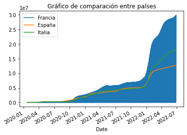

# Examen Periodismo de Datos - Parte Práctica

### *Diego Domínguez González - Periodismo y Humanidades Grupo 61*


```python
pip install pandas
```

    Defaulting to user installation because normal site-packages is not writeable
    Requirement already satisfied: pandas in /usr/local/lib/python3.8/dist-packages (1.3.1)
    Requirement already satisfied: python-dateutil>=2.7.3 in /usr/local/lib/python3.8/dist-packages (from pandas) (2.8.1)
    Requirement already satisfied: numpy>=1.17.3 in /usr/local/lib/python3.8/dist-packages (from pandas) (1.21.1)
    Requirement already satisfied: pytz>=2017.3 in /usr/local/lib/python3.8/dist-packages (from pandas) (2020.4)
    Requirement already satisfied: six>=1.5 in /usr/lib/python3/dist-packages (from python-dateutil>=2.7.3->pandas) (1.14.0)
    WARNING: You are using pip version 21.0.1; however, version 22.1.2 is available.
    You should consider upgrading via the '/usr/bin/python3 -m pip install --upgrade pip' command.
    Note: you may need to restart the kernel to use updated packages.


```python
import pandas as pd
```


```python
url = "https://api.covid19api.com/countries"
```


```python
df = pd.read_json(url)
```


```python
df
```


<div>
<style scoped>
    .dataframe tbody tr th:only-of-type {
        vertical-align: middle;
    }

    .dataframe tbody tr th {
        vertical-align: top;
    }

    .dataframe thead th {
        text-align: right;
    }
</style>
<table border="1" class="dataframe">
  <thead>
    <tr style="text-align: right;">
      <th></th>
      <th>Country</th>
      <th>Slug</th>
      <th>ISO2</th>
    </tr>
  </thead>
  <tbody>
    <tr>
      <th>0</th>
      <td>Falkland Islands (Malvinas)</td>
      <td>falkland-islands-malvinas</td>
      <td>FK</td>
    </tr>
    <tr>
      <th>1</th>
      <td>Panama</td>
      <td>panama</td>
      <td>PA</td>
    </tr>
    <tr>
      <th>2</th>
      <td>Russian Federation</td>
      <td>russia</td>
      <td>RU</td>
    </tr>
    <tr>
      <th>3</th>
      <td>Turkmenistan</td>
      <td>turkmenistan</td>
      <td>TM</td>
    </tr>
    <tr>
      <th>4</th>
      <td>Guinea</td>
      <td>guinea</td>
      <td>GN</td>
    </tr>
    <tr>
      <th>...</th>
      <td>...</td>
      <td>...</td>
      <td>...</td>
    </tr>
    <tr>
      <th>243</th>
      <td>Guyana</td>
      <td>guyana</td>
      <td>GY</td>
    </tr>
    <tr>
      <th>244</th>
      <td>Hungary</td>
      <td>hungary</td>
      <td>HU</td>
    </tr>
    <tr>
      <th>245</th>
      <td>Kazakhstan</td>
      <td>kazakhstan</td>
      <td>KZ</td>
    </tr>
    <tr>
      <th>246</th>
      <td>Liberia</td>
      <td>liberia</td>
      <td>LR</td>
    </tr>
    <tr>
      <th>247</th>
      <td>Somalia</td>
      <td>somalia</td>
      <td>SO</td>
    </tr>
  </tbody>
</table>
<p>248 rows × 3 columns</p>
</div>


```python
df.info()
```

    <class 'pandas.core.frame.DataFrame'>
    RangeIndex: 248 entries, 0 to 247
    Data columns (total 3 columns):
     #   Column   Non-Null Count  Dtype 
    ---  ------   --------------  ----- 
     0   Country  248 non-null    object
     1   Slug     248 non-null    object
     2   ISO2     248 non-null    object
    dtypes: object(3)
    memory usage: 5.9+ KB


## España


```python
url_esp = "https://api.covid19api.com/country/spain/status/confirmed/live"
```


```python
df_esp = pd.read_json(url_esp)
```


```python
df_esp
```


<div>
<style scoped>
    .dataframe tbody tr th:only-of-type {
        vertical-align: middle;
    }

    .dataframe tbody tr th {
        vertical-align: top;
    }

    .dataframe thead th {
        text-align: right;
    }
</style>
<table border="1" class="dataframe">
  <thead>
    <tr style="text-align: right;">
      <th></th>
      <th>Country</th>
      <th>CountryCode</th>
      <th>Province</th>
      <th>City</th>
      <th>CityCode</th>
      <th>Lat</th>
      <th>Lon</th>
      <th>Cases</th>
      <th>Status</th>
      <th>Date</th>
    </tr>
  </thead>
  <tbody>
    <tr>
      <th>0</th>
      <td>Spain</td>
      <td>ES</td>
      <td></td>
      <td></td>
      <td></td>
      <td>40.46</td>
      <td>-3.75</td>
      <td>0</td>
      <td>confirmed</td>
      <td>2020-01-22 00:00:00+00:00</td>
    </tr>
    <tr>
      <th>1</th>
      <td>Spain</td>
      <td>ES</td>
      <td></td>
      <td></td>
      <td></td>
      <td>40.46</td>
      <td>-3.75</td>
      <td>0</td>
      <td>confirmed</td>
      <td>2020-01-23 00:00:00+00:00</td>
    </tr>
    <tr>
      <th>2</th>
      <td>Spain</td>
      <td>ES</td>
      <td></td>
      <td></td>
      <td></td>
      <td>40.46</td>
      <td>-3.75</td>
      <td>0</td>
      <td>confirmed</td>
      <td>2020-01-24 00:00:00+00:00</td>
    </tr>
    <tr>
      <th>3</th>
      <td>Spain</td>
      <td>ES</td>
      <td></td>
      <td></td>
      <td></td>
      <td>40.46</td>
      <td>-3.75</td>
      <td>0</td>
      <td>confirmed</td>
      <td>2020-01-25 00:00:00+00:00</td>
    </tr>
    <tr>
      <th>4</th>
      <td>Spain</td>
      <td>ES</td>
      <td></td>
      <td></td>
      <td></td>
      <td>40.46</td>
      <td>-3.75</td>
      <td>0</td>
      <td>confirmed</td>
      <td>2020-01-26 00:00:00+00:00</td>
    </tr>
    <tr>
      <th>...</th>
      <td>...</td>
      <td>...</td>
      <td>...</td>
      <td>...</td>
      <td>...</td>
      <td>...</td>
      <td>...</td>
      <td>...</td>
      <td>...</td>
      <td>...</td>
    </tr>
    <tr>
      <th>883</th>
      <td>Spain</td>
      <td>ES</td>
      <td></td>
      <td></td>
      <td></td>
      <td>40.46</td>
      <td>-3.75</td>
      <td>12613634</td>
      <td>confirmed</td>
      <td>2022-06-23 00:00:00+00:00</td>
    </tr>
    <tr>
      <th>884</th>
      <td>Spain</td>
      <td>ES</td>
      <td></td>
      <td></td>
      <td></td>
      <td>40.46</td>
      <td>-3.75</td>
      <td>12681820</td>
      <td>confirmed</td>
      <td>2022-06-24 00:00:00+00:00</td>
    </tr>
    <tr>
      <th>885</th>
      <td>Spain</td>
      <td>ES</td>
      <td></td>
      <td></td>
      <td></td>
      <td>40.46</td>
      <td>-3.75</td>
      <td>12681820</td>
      <td>confirmed</td>
      <td>2022-06-25 00:00:00+00:00</td>
    </tr>
    <tr>
      <th>886</th>
      <td>Spain</td>
      <td>ES</td>
      <td></td>
      <td></td>
      <td></td>
      <td>40.46</td>
      <td>-3.75</td>
      <td>12681820</td>
      <td>confirmed</td>
      <td>2022-06-26 00:00:00+00:00</td>
    </tr>
    <tr>
      <th>887</th>
      <td>Spain</td>
      <td>ES</td>
      <td></td>
      <td></td>
      <td></td>
      <td>40.46</td>
      <td>-3.75</td>
      <td>12681820</td>
      <td>confirmed</td>
      <td>2022-06-27 00:00:00+00:00</td>
    </tr>
  </tbody>
</table>
<p>888 rows × 10 columns</p>
</div>


```python
df_esp.info()
```

    <class 'pandas.core.frame.DataFrame'>
    RangeIndex: 888 entries, 0 to 887
    Data columns (total 10 columns):
     #   Column       Non-Null Count  Dtype              
    ---  ------       --------------  -----              
     0   Country      888 non-null    object             
     1   CountryCode  888 non-null    object             
     2   Province     888 non-null    object             
     3   City         888 non-null    object             
     4   CityCode     888 non-null    object             
     5   Lat          888 non-null    float64            
     6   Lon          888 non-null    float64            
     7   Cases        888 non-null    int64              
     8   Status       888 non-null    object             
     9   Date         888 non-null    datetime64[ns, UTC]
    dtypes: datetime64[ns, UTC](1), float64(2), int64(1), object(6)
    memory usage: 69.5+ KB


```python
df_esp ["Date"][1]
```


    Timestamp('2020-01-23 00:00:00+0000', tz='UTC')


```python
df_esp.describe()
```


<div>
<style scoped>
    .dataframe tbody tr th:only-of-type {
        vertical-align: middle;
    }

    .dataframe tbody tr th {
        vertical-align: top;
    }

    .dataframe thead th {
        text-align: right;
    }
</style>
<table border="1" class="dataframe">
  <thead>
    <tr style="text-align: right;">
      <th></th>
      <th>Lat</th>
      <th>Lon</th>
      <th>Cases</th>
    </tr>
  </thead>
  <tbody>
    <tr>
      <th>count</th>
      <td>8.880000e+02</td>
      <td>888.00</td>
      <td>8.880000e+02</td>
    </tr>
    <tr>
      <th>mean</th>
      <td>4.046000e+01</td>
      <td>-3.75</td>
      <td>4.092078e+06</td>
    </tr>
    <tr>
      <th>std</th>
      <td>7.109432e-15</td>
      <td>0.00</td>
      <td>3.947626e+06</td>
    </tr>
    <tr>
      <th>min</th>
      <td>4.046000e+01</td>
      <td>-3.75</td>
      <td>0.000000e+00</td>
    </tr>
    <tr>
      <th>25%</th>
      <td>4.046000e+01</td>
      <td>-3.75</td>
      <td>4.569650e+05</td>
    </tr>
    <tr>
      <th>50%</th>
      <td>4.046000e+01</td>
      <td>-3.75</td>
      <td>3.347512e+06</td>
    </tr>
    <tr>
      <th>75%</th>
      <td>4.046000e+01</td>
      <td>-3.75</td>
      <td>5.069291e+06</td>
    </tr>
    <tr>
      <th>max</th>
      <td>4.046000e+01</td>
      <td>-3.75</td>
      <td>1.268182e+07</td>
    </tr>
  </tbody>
</table>
</div>


```python
df_esp.set_index("Date")
```


<div>
<style scoped>
    .dataframe tbody tr th:only-of-type {
        vertical-align: middle;
    }

    .dataframe tbody tr th {
        vertical-align: top;
    }

    .dataframe thead th {
        text-align: right;
    }
</style>
<table border="1" class="dataframe">
  <thead>
    <tr style="text-align: right;">
      <th></th>
      <th>Country</th>
      <th>CountryCode</th>
      <th>Province</th>
      <th>City</th>
      <th>CityCode</th>
      <th>Lat</th>
      <th>Lon</th>
      <th>Cases</th>
      <th>Status</th>
    </tr>
    <tr>
      <th>Date</th>
      <th></th>
      <th></th>
      <th></th>
      <th></th>
      <th></th>
      <th></th>
      <th></th>
      <th></th>
      <th></th>
    </tr>
  </thead>
  <tbody>
    <tr>
      <th>2020-01-22 00:00:00+00:00</th>
      <td>Spain</td>
      <td>ES</td>
      <td></td>
      <td></td>
      <td></td>
      <td>40.46</td>
      <td>-3.75</td>
      <td>0</td>
      <td>confirmed</td>
    </tr>
    <tr>
      <th>2020-01-23 00:00:00+00:00</th>
      <td>Spain</td>
      <td>ES</td>
      <td></td>
      <td></td>
      <td></td>
      <td>40.46</td>
      <td>-3.75</td>
      <td>0</td>
      <td>confirmed</td>
    </tr>
    <tr>
      <th>2020-01-24 00:00:00+00:00</th>
      <td>Spain</td>
      <td>ES</td>
      <td></td>
      <td></td>
      <td></td>
      <td>40.46</td>
      <td>-3.75</td>
      <td>0</td>
      <td>confirmed</td>
    </tr>
    <tr>
      <th>2020-01-25 00:00:00+00:00</th>
      <td>Spain</td>
      <td>ES</td>
      <td></td>
      <td></td>
      <td></td>
      <td>40.46</td>
      <td>-3.75</td>
      <td>0</td>
      <td>confirmed</td>
    </tr>
    <tr>
      <th>2020-01-26 00:00:00+00:00</th>
      <td>Spain</td>
      <td>ES</td>
      <td></td>
      <td></td>
      <td></td>
      <td>40.46</td>
      <td>-3.75</td>
      <td>0</td>
      <td>confirmed</td>
    </tr>
    <tr>
      <th>...</th>
      <td>...</td>
      <td>...</td>
      <td>...</td>
      <td>...</td>
      <td>...</td>
      <td>...</td>
      <td>...</td>
      <td>...</td>
      <td>...</td>
    </tr>
    <tr>
      <th>2022-06-23 00:00:00+00:00</th>
      <td>Spain</td>
      <td>ES</td>
      <td></td>
      <td></td>
      <td></td>
      <td>40.46</td>
      <td>-3.75</td>
      <td>12613634</td>
      <td>confirmed</td>
    </tr>
    <tr>
      <th>2022-06-24 00:00:00+00:00</th>
      <td>Spain</td>
      <td>ES</td>
      <td></td>
      <td></td>
      <td></td>
      <td>40.46</td>
      <td>-3.75</td>
      <td>12681820</td>
      <td>confirmed</td>
    </tr>
    <tr>
      <th>2022-06-25 00:00:00+00:00</th>
      <td>Spain</td>
      <td>ES</td>
      <td></td>
      <td></td>
      <td></td>
      <td>40.46</td>
      <td>-3.75</td>
      <td>12681820</td>
      <td>confirmed</td>
    </tr>
    <tr>
      <th>2022-06-26 00:00:00+00:00</th>
      <td>Spain</td>
      <td>ES</td>
      <td></td>
      <td></td>
      <td></td>
      <td>40.46</td>
      <td>-3.75</td>
      <td>12681820</td>
      <td>confirmed</td>
    </tr>
    <tr>
      <th>2022-06-27 00:00:00+00:00</th>
      <td>Spain</td>
      <td>ES</td>
      <td></td>
      <td></td>
      <td></td>
      <td>40.46</td>
      <td>-3.75</td>
      <td>12681820</td>
      <td>confirmed</td>
    </tr>
  </tbody>
</table>
<p>888 rows × 9 columns</p>
</div>


```python
df_esp.set_index("Date")["Cases"]
```


    Date
    2020-01-22 00:00:00+00:00           0
    2020-01-23 00:00:00+00:00           0
    2020-01-24 00:00:00+00:00           0
    2020-01-25 00:00:00+00:00           0
    2020-01-26 00:00:00+00:00           0
                                   ...   
    2022-06-23 00:00:00+00:00    12613634
    2022-06-24 00:00:00+00:00    12681820
    2022-06-25 00:00:00+00:00    12681820
    2022-06-26 00:00:00+00:00    12681820
    2022-06-27 00:00:00+00:00    12681820
    Name: Cases, Length: 888, dtype: int64


```python
df_esp.set_index("Date")["Cases"].plot(title="Casos España Covid")
```


    <AxesSubplot:title={'center':'Casos España Covid'}, xlabel='Date'>





## Francia


```python
url_fra = "https://api.covid19api.com/country/france/status/confirmed/live"
```


```python
df_fra = pd.read_json(url_fra)
```


```python
df_fra
```


<div>
<style scoped>
    .dataframe tbody tr th:only-of-type {
        vertical-align: middle;
    }

    .dataframe tbody tr th {
        vertical-align: top;
    }

    .dataframe thead th {
        text-align: right;
    }
</style>
<table border="1" class="dataframe">
  <thead>
    <tr style="text-align: right;">
      <th></th>
      <th>Country</th>
      <th>CountryCode</th>
      <th>Province</th>
      <th>City</th>
      <th>CityCode</th>
      <th>Lat</th>
      <th>Lon</th>
      <th>Cases</th>
      <th>Status</th>
      <th>Date</th>
    </tr>
  </thead>
  <tbody>
    <tr>
      <th>0</th>
      <td>France</td>
      <td>FR</td>
      <td>Martinique</td>
      <td></td>
      <td></td>
      <td>14.64</td>
      <td>-61.02</td>
      <td>0</td>
      <td>confirmed</td>
      <td>2020-01-22 00:00:00+00:00</td>
    </tr>
    <tr>
      <th>1</th>
      <td>France</td>
      <td>FR</td>
      <td>New Caledonia</td>
      <td></td>
      <td></td>
      <td>-20.90</td>
      <td>165.62</td>
      <td>0</td>
      <td>confirmed</td>
      <td>2020-01-22 00:00:00+00:00</td>
    </tr>
    <tr>
      <th>2</th>
      <td>France</td>
      <td>FR</td>
      <td>Reunion</td>
      <td></td>
      <td></td>
      <td>-21.12</td>
      <td>55.54</td>
      <td>0</td>
      <td>confirmed</td>
      <td>2020-01-22 00:00:00+00:00</td>
    </tr>
    <tr>
      <th>3</th>
      <td>France</td>
      <td>FR</td>
      <td>Wallis and Futuna</td>
      <td></td>
      <td></td>
      <td>-14.29</td>
      <td>-178.12</td>
      <td>0</td>
      <td>confirmed</td>
      <td>2020-01-22 00:00:00+00:00</td>
    </tr>
    <tr>
      <th>4</th>
      <td>France</td>
      <td>FR</td>
      <td>French Guiana</td>
      <td></td>
      <td></td>
      <td>4.00</td>
      <td>-53.00</td>
      <td>0</td>
      <td>confirmed</td>
      <td>2020-01-22 00:00:00+00:00</td>
    </tr>
    <tr>
      <th>...</th>
      <td>...</td>
      <td>...</td>
      <td>...</td>
      <td>...</td>
      <td>...</td>
      <td>...</td>
      <td>...</td>
      <td>...</td>
      <td>...</td>
      <td>...</td>
    </tr>
    <tr>
      <th>10652</th>
      <td>France</td>
      <td>FR</td>
      <td>Mayotte</td>
      <td></td>
      <td></td>
      <td>-12.83</td>
      <td>45.17</td>
      <td>37877</td>
      <td>confirmed</td>
      <td>2022-06-27 00:00:00+00:00</td>
    </tr>
    <tr>
      <th>10653</th>
      <td>France</td>
      <td>FR</td>
      <td>Saint Barthelemy</td>
      <td></td>
      <td></td>
      <td>17.90</td>
      <td>-62.83</td>
      <td>4671</td>
      <td>confirmed</td>
      <td>2022-06-27 00:00:00+00:00</td>
    </tr>
    <tr>
      <th>10654</th>
      <td>France</td>
      <td>FR</td>
      <td>French Guiana</td>
      <td></td>
      <td></td>
      <td>3.93</td>
      <td>-53.13</td>
      <td>85596</td>
      <td>confirmed</td>
      <td>2022-06-27 00:00:00+00:00</td>
    </tr>
    <tr>
      <th>10655</th>
      <td>France</td>
      <td>FR</td>
      <td>Reunion</td>
      <td></td>
      <td></td>
      <td>-21.12</td>
      <td>55.54</td>
      <td>421269</td>
      <td>confirmed</td>
      <td>2022-06-27 00:00:00+00:00</td>
    </tr>
    <tr>
      <th>10656</th>
      <td>France</td>
      <td>FR</td>
      <td></td>
      <td></td>
      <td></td>
      <td>46.23</td>
      <td>2.21</td>
      <td>29823387</td>
      <td>confirmed</td>
      <td>2022-06-28 00:00:00+00:00</td>
    </tr>
  </tbody>
</table>
<p>10657 rows × 10 columns</p>
</div>


```python
df_fra.describe()
```


<div>
<style scoped>
    .dataframe tbody tr th:only-of-type {
        vertical-align: middle;
    }

    .dataframe tbody tr th {
        vertical-align: top;
    }

    .dataframe thead th {
        text-align: right;
    }
</style>
<table border="1" class="dataframe">
  <thead>
    <tr style="text-align: right;">
      <th></th>
      <th>Lat</th>
      <th>Lon</th>
      <th>Cases</th>
    </tr>
  </thead>
  <tbody>
    <tr>
      <th>count</th>
      <td>10657.000000</td>
      <td>10657.000000</td>
      <td>1.065700e+04</td>
    </tr>
    <tr>
      <th>mean</th>
      <td>6.433109</td>
      <td>-34.730791</td>
      <td>6.325769e+05</td>
    </tr>
    <tr>
      <th>std</th>
      <td>23.358877</td>
      <td>88.296378</td>
      <td>3.279857e+06</td>
    </tr>
    <tr>
      <th>min</th>
      <td>-21.120000</td>
      <td>-178.120000</td>
      <td>0.000000e+00</td>
    </tr>
    <tr>
      <th>25%</th>
      <td>-14.290000</td>
      <td>-62.830000</td>
      <td>1.090000e+02</td>
    </tr>
    <tr>
      <th>50%</th>
      <td>14.640000</td>
      <td>-56.320000</td>
      <td>3.819000e+03</td>
    </tr>
    <tr>
      <th>75%</th>
      <td>18.070000</td>
      <td>2.210000</td>
      <td>3.595300e+04</td>
    </tr>
    <tr>
      <th>max</th>
      <td>46.890000</td>
      <td>165.620000</td>
      <td>2.982339e+07</td>
    </tr>
  </tbody>
</table>
</div>


```python
df_fra.set_index("Date")
```


<div>
<style scoped>
    .dataframe tbody tr th:only-of-type {
        vertical-align: middle;
    }

    .dataframe tbody tr th {
        vertical-align: top;
    }

    .dataframe thead th {
        text-align: right;
    }
</style>
<table border="1" class="dataframe">
  <thead>
    <tr style="text-align: right;">
      <th></th>
      <th>Country</th>
      <th>CountryCode</th>
      <th>Province</th>
      <th>City</th>
      <th>CityCode</th>
      <th>Lat</th>
      <th>Lon</th>
      <th>Cases</th>
      <th>Status</th>
    </tr>
    <tr>
      <th>Date</th>
      <th></th>
      <th></th>
      <th></th>
      <th></th>
      <th></th>
      <th></th>
      <th></th>
      <th></th>
      <th></th>
    </tr>
  </thead>
  <tbody>
    <tr>
      <th>2020-01-22 00:00:00+00:00</th>
      <td>France</td>
      <td>FR</td>
      <td>Martinique</td>
      <td></td>
      <td></td>
      <td>14.64</td>
      <td>-61.02</td>
      <td>0</td>
      <td>confirmed</td>
    </tr>
    <tr>
      <th>2020-01-22 00:00:00+00:00</th>
      <td>France</td>
      <td>FR</td>
      <td>New Caledonia</td>
      <td></td>
      <td></td>
      <td>-20.90</td>
      <td>165.62</td>
      <td>0</td>
      <td>confirmed</td>
    </tr>
    <tr>
      <th>2020-01-22 00:00:00+00:00</th>
      <td>France</td>
      <td>FR</td>
      <td>Reunion</td>
      <td></td>
      <td></td>
      <td>-21.12</td>
      <td>55.54</td>
      <td>0</td>
      <td>confirmed</td>
    </tr>
    <tr>
      <th>2020-01-22 00:00:00+00:00</th>
      <td>France</td>
      <td>FR</td>
      <td>Wallis and Futuna</td>
      <td></td>
      <td></td>
      <td>-14.29</td>
      <td>-178.12</td>
      <td>0</td>
      <td>confirmed</td>
    </tr>
    <tr>
      <th>2020-01-22 00:00:00+00:00</th>
      <td>France</td>
      <td>FR</td>
      <td>French Guiana</td>
      <td></td>
      <td></td>
      <td>4.00</td>
      <td>-53.00</td>
      <td>0</td>
      <td>confirmed</td>
    </tr>
    <tr>
      <th>...</th>
      <td>...</td>
      <td>...</td>
      <td>...</td>
      <td>...</td>
      <td>...</td>
      <td>...</td>
      <td>...</td>
      <td>...</td>
      <td>...</td>
    </tr>
    <tr>
      <th>2022-06-27 00:00:00+00:00</th>
      <td>France</td>
      <td>FR</td>
      <td>Mayotte</td>
      <td></td>
      <td></td>
      <td>-12.83</td>
      <td>45.17</td>
      <td>37877</td>
      <td>confirmed</td>
    </tr>
    <tr>
      <th>2022-06-27 00:00:00+00:00</th>
      <td>France</td>
      <td>FR</td>
      <td>Saint Barthelemy</td>
      <td></td>
      <td></td>
      <td>17.90</td>
      <td>-62.83</td>
      <td>4671</td>
      <td>confirmed</td>
    </tr>
    <tr>
      <th>2022-06-27 00:00:00+00:00</th>
      <td>France</td>
      <td>FR</td>
      <td>French Guiana</td>
      <td></td>
      <td></td>
      <td>3.93</td>
      <td>-53.13</td>
      <td>85596</td>
      <td>confirmed</td>
    </tr>
    <tr>
      <th>2022-06-27 00:00:00+00:00</th>
      <td>France</td>
      <td>FR</td>
      <td>Reunion</td>
      <td></td>
      <td></td>
      <td>-21.12</td>
      <td>55.54</td>
      <td>421269</td>
      <td>confirmed</td>
    </tr>
    <tr>
      <th>2022-06-28 00:00:00+00:00</th>
      <td>France</td>
      <td>FR</td>
      <td></td>
      <td></td>
      <td></td>
      <td>46.23</td>
      <td>2.21</td>
      <td>29823387</td>
      <td>confirmed</td>
    </tr>
  </tbody>
</table>
<p>10657 rows × 9 columns</p>
</div>


```python
df_fra.set_index("Date")["Cases"]
```


    Date
    2020-01-22 00:00:00+00:00           0
    2020-01-22 00:00:00+00:00           0
    2020-01-22 00:00:00+00:00           0
    2020-01-22 00:00:00+00:00           0
    2020-01-22 00:00:00+00:00           0
                                   ...   
    2022-06-27 00:00:00+00:00       37877
    2022-06-27 00:00:00+00:00        4671
    2022-06-27 00:00:00+00:00       85596
    2022-06-27 00:00:00+00:00      421269
    2022-06-28 00:00:00+00:00    29823387
    Name: Cases, Length: 10657, dtype: int64


```python
df_fra.set_index("Date")["Cases"].plot(title="Casos Francia Covid")
```


    <AxesSubplot:title={'center':'Casos Francia Covid'}, xlabel='Date'>





## Italia


```python
url_ita = "https://api.covid19api.com/country/italy/status/confirmed/live"
```


```python
df_ita = pd.read_json(url_ita)
```


```python
df_ita
```


<div>
<style scoped>
    .dataframe tbody tr th:only-of-type {
        vertical-align: middle;
    }

    .dataframe tbody tr th {
        vertical-align: top;
    }

    .dataframe thead th {
        text-align: right;
    }
</style>
<table border="1" class="dataframe">
  <thead>
    <tr style="text-align: right;">
      <th></th>
      <th>Country</th>
      <th>CountryCode</th>
      <th>Province</th>
      <th>City</th>
      <th>CityCode</th>
      <th>Lat</th>
      <th>Lon</th>
      <th>Cases</th>
      <th>Status</th>
      <th>Date</th>
    </tr>
  </thead>
  <tbody>
    <tr>
      <th>0</th>
      <td>Italy</td>
      <td>IT</td>
      <td></td>
      <td></td>
      <td></td>
      <td>41.87</td>
      <td>12.57</td>
      <td>0</td>
      <td>confirmed</td>
      <td>2020-01-22 00:00:00+00:00</td>
    </tr>
    <tr>
      <th>1</th>
      <td>Italy</td>
      <td>IT</td>
      <td></td>
      <td></td>
      <td></td>
      <td>41.87</td>
      <td>12.57</td>
      <td>0</td>
      <td>confirmed</td>
      <td>2020-01-23 00:00:00+00:00</td>
    </tr>
    <tr>
      <th>2</th>
      <td>Italy</td>
      <td>IT</td>
      <td></td>
      <td></td>
      <td></td>
      <td>41.87</td>
      <td>12.57</td>
      <td>0</td>
      <td>confirmed</td>
      <td>2020-01-24 00:00:00+00:00</td>
    </tr>
    <tr>
      <th>3</th>
      <td>Italy</td>
      <td>IT</td>
      <td></td>
      <td></td>
      <td></td>
      <td>41.87</td>
      <td>12.57</td>
      <td>0</td>
      <td>confirmed</td>
      <td>2020-01-25 00:00:00+00:00</td>
    </tr>
    <tr>
      <th>4</th>
      <td>Italy</td>
      <td>IT</td>
      <td></td>
      <td></td>
      <td></td>
      <td>41.87</td>
      <td>12.57</td>
      <td>0</td>
      <td>confirmed</td>
      <td>2020-01-26 00:00:00+00:00</td>
    </tr>
    <tr>
      <th>...</th>
      <td>...</td>
      <td>...</td>
      <td>...</td>
      <td>...</td>
      <td>...</td>
      <td>...</td>
      <td>...</td>
      <td>...</td>
      <td>...</td>
      <td>...</td>
    </tr>
    <tr>
      <th>883</th>
      <td>Italy</td>
      <td>IT</td>
      <td></td>
      <td></td>
      <td></td>
      <td>41.87</td>
      <td>12.57</td>
      <td>18071634</td>
      <td>confirmed</td>
      <td>2022-06-23 00:00:00+00:00</td>
    </tr>
    <tr>
      <th>884</th>
      <td>Italy</td>
      <td>IT</td>
      <td></td>
      <td></td>
      <td></td>
      <td>41.87</td>
      <td>12.57</td>
      <td>18128044</td>
      <td>confirmed</td>
      <td>2022-06-24 00:00:00+00:00</td>
    </tr>
    <tr>
      <th>885</th>
      <td>Italy</td>
      <td>IT</td>
      <td></td>
      <td></td>
      <td></td>
      <td>41.87</td>
      <td>12.57</td>
      <td>18184917</td>
      <td>confirmed</td>
      <td>2022-06-25 00:00:00+00:00</td>
    </tr>
    <tr>
      <th>886</th>
      <td>Italy</td>
      <td>IT</td>
      <td></td>
      <td></td>
      <td></td>
      <td>41.87</td>
      <td>12.57</td>
      <td>18234242</td>
      <td>confirmed</td>
      <td>2022-06-26 00:00:00+00:00</td>
    </tr>
    <tr>
      <th>887</th>
      <td>Italy</td>
      <td>IT</td>
      <td></td>
      <td></td>
      <td></td>
      <td>41.87</td>
      <td>12.57</td>
      <td>18259261</td>
      <td>confirmed</td>
      <td>2022-06-27 00:00:00+00:00</td>
    </tr>
  </tbody>
</table>
<p>888 rows × 10 columns</p>
</div>


```python
df_ita.describe()
```


<div>
<style scoped>
    .dataframe tbody tr th:only-of-type {
        vertical-align: middle;
    }

    .dataframe tbody tr th {
        vertical-align: top;
    }

    .dataframe thead th {
        text-align: right;
    }
</style>
<table border="1" class="dataframe">
  <thead>
    <tr style="text-align: right;">
      <th></th>
      <th>Lat</th>
      <th>Lon</th>
      <th>Cases</th>
    </tr>
  </thead>
  <tbody>
    <tr>
      <th>count</th>
      <td>888.00</td>
      <td>8.880000e+02</td>
      <td>8.880000e+02</td>
    </tr>
    <tr>
      <th>mean</th>
      <td>41.87</td>
      <td>1.257000e+01</td>
      <td>4.670686e+06</td>
    </tr>
    <tr>
      <th>std</th>
      <td>0.00</td>
      <td>1.777358e-15</td>
      <td>5.231011e+06</td>
    </tr>
    <tr>
      <th>min</th>
      <td>41.87</td>
      <td>1.257000e+01</td>
      <td>0.000000e+00</td>
    </tr>
    <tr>
      <th>25%</th>
      <td>41.87</td>
      <td>1.257000e+01</td>
      <td>2.689650e+05</td>
    </tr>
    <tr>
      <th>50%</th>
      <td>41.87</td>
      <td>1.257000e+01</td>
      <td>3.745302e+06</td>
    </tr>
    <tr>
      <th>75%</th>
      <td>41.87</td>
      <td>1.257000e+01</td>
      <td>4.885903e+06</td>
    </tr>
    <tr>
      <th>max</th>
      <td>41.87</td>
      <td>1.257000e+01</td>
      <td>1.825926e+07</td>
    </tr>
  </tbody>
</table>
</div>


```python
df_ita.set_index("Date")
```


<div>
<style scoped>
    .dataframe tbody tr th:only-of-type {
        vertical-align: middle;
    }

    .dataframe tbody tr th {
        vertical-align: top;
    }

    .dataframe thead th {
        text-align: right;
    }
</style>
<table border="1" class="dataframe">
  <thead>
    <tr style="text-align: right;">
      <th></th>
      <th>Country</th>
      <th>CountryCode</th>
      <th>Province</th>
      <th>City</th>
      <th>CityCode</th>
      <th>Lat</th>
      <th>Lon</th>
      <th>Cases</th>
      <th>Status</th>
    </tr>
    <tr>
      <th>Date</th>
      <th></th>
      <th></th>
      <th></th>
      <th></th>
      <th></th>
      <th></th>
      <th></th>
      <th></th>
      <th></th>
    </tr>
  </thead>
  <tbody>
    <tr>
      <th>2020-01-22 00:00:00+00:00</th>
      <td>Italy</td>
      <td>IT</td>
      <td></td>
      <td></td>
      <td></td>
      <td>41.87</td>
      <td>12.57</td>
      <td>0</td>
      <td>confirmed</td>
    </tr>
    <tr>
      <th>2020-01-23 00:00:00+00:00</th>
      <td>Italy</td>
      <td>IT</td>
      <td></td>
      <td></td>
      <td></td>
      <td>41.87</td>
      <td>12.57</td>
      <td>0</td>
      <td>confirmed</td>
    </tr>
    <tr>
      <th>2020-01-24 00:00:00+00:00</th>
      <td>Italy</td>
      <td>IT</td>
      <td></td>
      <td></td>
      <td></td>
      <td>41.87</td>
      <td>12.57</td>
      <td>0</td>
      <td>confirmed</td>
    </tr>
    <tr>
      <th>2020-01-25 00:00:00+00:00</th>
      <td>Italy</td>
      <td>IT</td>
      <td></td>
      <td></td>
      <td></td>
      <td>41.87</td>
      <td>12.57</td>
      <td>0</td>
      <td>confirmed</td>
    </tr>
    <tr>
      <th>2020-01-26 00:00:00+00:00</th>
      <td>Italy</td>
      <td>IT</td>
      <td></td>
      <td></td>
      <td></td>
      <td>41.87</td>
      <td>12.57</td>
      <td>0</td>
      <td>confirmed</td>
    </tr>
    <tr>
      <th>...</th>
      <td>...</td>
      <td>...</td>
      <td>...</td>
      <td>...</td>
      <td>...</td>
      <td>...</td>
      <td>...</td>
      <td>...</td>
      <td>...</td>
    </tr>
    <tr>
      <th>2022-06-23 00:00:00+00:00</th>
      <td>Italy</td>
      <td>IT</td>
      <td></td>
      <td></td>
      <td></td>
      <td>41.87</td>
      <td>12.57</td>
      <td>18071634</td>
      <td>confirmed</td>
    </tr>
    <tr>
      <th>2022-06-24 00:00:00+00:00</th>
      <td>Italy</td>
      <td>IT</td>
      <td></td>
      <td></td>
      <td></td>
      <td>41.87</td>
      <td>12.57</td>
      <td>18128044</td>
      <td>confirmed</td>
    </tr>
    <tr>
      <th>2022-06-25 00:00:00+00:00</th>
      <td>Italy</td>
      <td>IT</td>
      <td></td>
      <td></td>
      <td></td>
      <td>41.87</td>
      <td>12.57</td>
      <td>18184917</td>
      <td>confirmed</td>
    </tr>
    <tr>
      <th>2022-06-26 00:00:00+00:00</th>
      <td>Italy</td>
      <td>IT</td>
      <td></td>
      <td></td>
      <td></td>
      <td>41.87</td>
      <td>12.57</td>
      <td>18234242</td>
      <td>confirmed</td>
    </tr>
    <tr>
      <th>2022-06-27 00:00:00+00:00</th>
      <td>Italy</td>
      <td>IT</td>
      <td></td>
      <td></td>
      <td></td>
      <td>41.87</td>
      <td>12.57</td>
      <td>18259261</td>
      <td>confirmed</td>
    </tr>
  </tbody>
</table>
<p>888 rows × 9 columns</p>
</div>


```python
df_ita.set_index("Date")["Cases"]
```


    Date
    2020-01-22 00:00:00+00:00           0
    2020-01-23 00:00:00+00:00           0
    2020-01-24 00:00:00+00:00           0
    2020-01-25 00:00:00+00:00           0
    2020-01-26 00:00:00+00:00           0
                                   ...   
    2022-06-23 00:00:00+00:00    18071634
    2022-06-24 00:00:00+00:00    18128044
    2022-06-25 00:00:00+00:00    18184917
    2022-06-26 00:00:00+00:00    18234242
    2022-06-27 00:00:00+00:00    18259261
    Name: Cases, Length: 888, dtype: int64


```python
df_ita.set_index("Date")["Cases"].plot(title="Casos Italia Covid")
```


    <AxesSubplot:title={'center':'Casos Italia Covid'}, xlabel='Date'>





## Gráfico de los 3 países


```python
casos_fra = df_fra.set_index("Date")["Cases"]
casos_esp = df_esp.set_index("Date")["Cases"]
casos_ita = df_ita.set_index("Date")["Cases"]
```


```python
vs = pd.concat([casos_fra,casos_esp,casos_ita],axis=1)
```


```python
vs
```


<div>
<style scoped>
    .dataframe tbody tr th:only-of-type {
        vertical-align: middle;
    }

    .dataframe tbody tr th {
        vertical-align: top;
    }

    .dataframe thead th {
        text-align: right;
    }
</style>
<table border="1" class="dataframe">
  <thead>
    <tr style="text-align: right;">
      <th></th>
      <th>Cases</th>
      <th>Cases</th>
      <th>Cases</th>
    </tr>
    <tr>
      <th>Date</th>
      <th></th>
      <th></th>
      <th></th>
    </tr>
  </thead>
  <tbody>
    <tr>
      <th>2020-01-22 00:00:00+00:00</th>
      <td>0.0</td>
      <td>0</td>
      <td>0.0</td>
    </tr>
    <tr>
      <th>2020-01-22 00:00:00+00:00</th>
      <td>0.0</td>
      <td>0</td>
      <td>0.0</td>
    </tr>
    <tr>
      <th>2020-01-22 00:00:00+00:00</th>
      <td>0.0</td>
      <td>0</td>
      <td>0.0</td>
    </tr>
    <tr>
      <th>2020-01-22 00:00:00+00:00</th>
      <td>0.0</td>
      <td>0</td>
      <td>0.0</td>
    </tr>
    <tr>
      <th>2020-01-22 00:00:00+00:00</th>
      <td>0.0</td>
      <td>0</td>
      <td>0.0</td>
    </tr>
    <tr>
      <th>...</th>
      <td>...</td>
      <td>...</td>
      <td>...</td>
    </tr>
    <tr>
      <th>2022-06-27 00:00:00+00:00</th>
      <td>12681820.0</td>
      <td>37877</td>
      <td>18259261.0</td>
    </tr>
    <tr>
      <th>2022-06-27 00:00:00+00:00</th>
      <td>12681820.0</td>
      <td>4671</td>
      <td>18259261.0</td>
    </tr>
    <tr>
      <th>2022-06-27 00:00:00+00:00</th>
      <td>12681820.0</td>
      <td>85596</td>
      <td>18259261.0</td>
    </tr>
    <tr>
      <th>2022-06-27 00:00:00+00:00</th>
      <td>12681820.0</td>
      <td>421269</td>
      <td>18259261.0</td>
    </tr>
    <tr>
      <th>2022-06-28 00:00:00+00:00</th>
      <td>NaN</td>
      <td>29823387</td>
      <td>NaN</td>
    </tr>
  </tbody>
</table>
<p>10657 rows × 3 columns</p>
</div>


```python
vs.columns = ["Francia","España","Italia"]
```


```python
vs
```


<div>
<style scoped>
    .dataframe tbody tr th:only-of-type {
        vertical-align: middle;
    }

    .dataframe tbody tr th {
        vertical-align: top;
    }

    .dataframe thead th {
        text-align: right;
    }
</style>
<table border="1" class="dataframe">
  <thead>
    <tr style="text-align: right;">
      <th></th>
      <th>Francia</th>
      <th>España</th>
      <th>Italia</th>
    </tr>
    <tr>
      <th>Date</th>
      <th></th>
      <th></th>
      <th></th>
    </tr>
  </thead>
  <tbody>
    <tr>
      <th>2020-01-22 00:00:00+00:00</th>
      <td>0</td>
      <td>0.0</td>
      <td>0.0</td>
    </tr>
    <tr>
      <th>2020-01-22 00:00:00+00:00</th>
      <td>0</td>
      <td>0.0</td>
      <td>0.0</td>
    </tr>
    <tr>
      <th>2020-01-22 00:00:00+00:00</th>
      <td>0</td>
      <td>0.0</td>
      <td>0.0</td>
    </tr>
    <tr>
      <th>2020-01-22 00:00:00+00:00</th>
      <td>0</td>
      <td>0.0</td>
      <td>0.0</td>
    </tr>
    <tr>
      <th>2020-01-22 00:00:00+00:00</th>
      <td>0</td>
      <td>0.0</td>
      <td>0.0</td>
    </tr>
    <tr>
      <th>...</th>
      <td>...</td>
      <td>...</td>
      <td>...</td>
    </tr>
    <tr>
      <th>2022-06-27 00:00:00+00:00</th>
      <td>37877</td>
      <td>12681820.0</td>
      <td>18259261.0</td>
    </tr>
    <tr>
      <th>2022-06-27 00:00:00+00:00</th>
      <td>4671</td>
      <td>12681820.0</td>
      <td>18259261.0</td>
    </tr>
    <tr>
      <th>2022-06-27 00:00:00+00:00</th>
      <td>85596</td>
      <td>12681820.0</td>
      <td>18259261.0</td>
    </tr>
    <tr>
      <th>2022-06-27 00:00:00+00:00</th>
      <td>421269</td>
      <td>12681820.0</td>
      <td>18259261.0</td>
    </tr>
    <tr>
      <th>2022-06-28 00:00:00+00:00</th>
      <td>29823387</td>
      <td>NaN</td>
      <td>NaN</td>
    </tr>
  </tbody>
</table>
<p>10657 rows × 3 columns</p>
</div>


```python
vs.plot(title="Gráfico de comparación entre países")
```


    <AxesSubplot:title={'center':'Gráfico de comparación entre países'}, xlabel='Date'>




